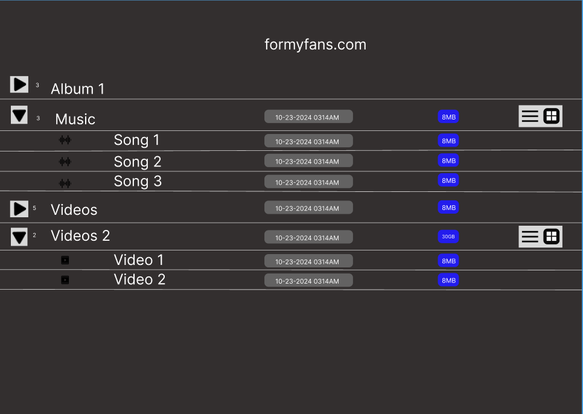

# artist-music-showcase
Website Design made for artists by artists. Direct artist2fan interaction made easy.

## Purpose of Site:

Website template that can be personalized for a music artist to showcase content for their fans. The site allows direct interaction with fans that can be used as leverage for other avenues as an artist.

## Target Audience: 

**Musicians/Artists/Producers/Content Creators**

## Key Features: 

- Smooth, Interactive Design 
- Multiple Download options for files
- In-site Music/Video Player 
- Newsletter Subscription for exclusive content drops
- Personalized for each musician

# Requirements (Subject to change):

Amazon Web Services + MYSQL

## TECH STACK (Subject to change): 

### Front-end (Client-Side): HTML, CSS/Sass, Vanilla Javascript
### Back-end (Server-Side): Python, PHP, Node.js
### Database: MySQL
### Cloud: Amazon Web Services, Docker Containers

# Designs:
**THIS IS NOT THE FINAL DESIGN** 

## Desktop (No Content Selection)

## Mobile 

## Tablet

# Project Deliverables (Subject to change): 

- [] Figma Designs 
  - [] Mobile
  - [] Tablet 
  - [x] Desktop
- [] Project Overview
- [] Setup Amazon Web Services
- [] Link to MYSQL
- [] Back-end Development 
- [] Front-end Development 
- []Upload Wireframe Design
